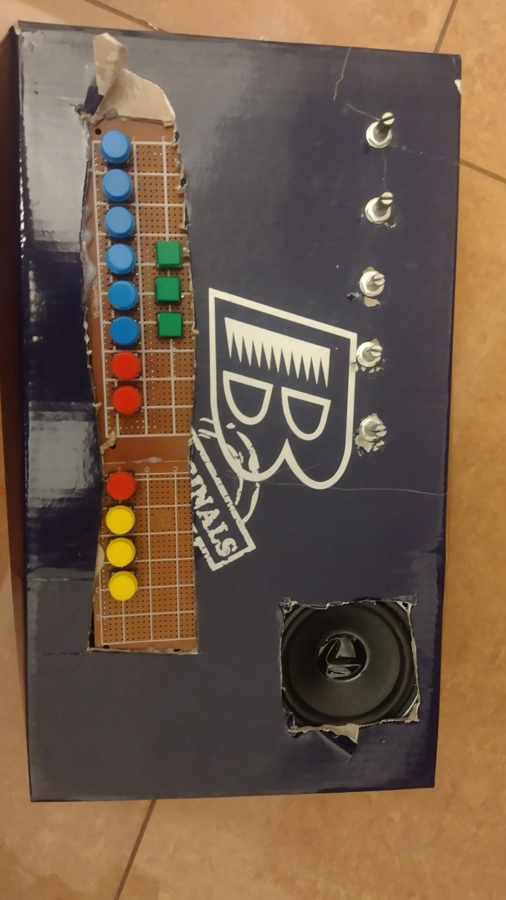
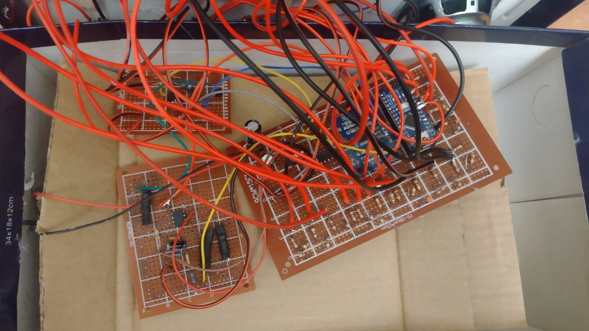
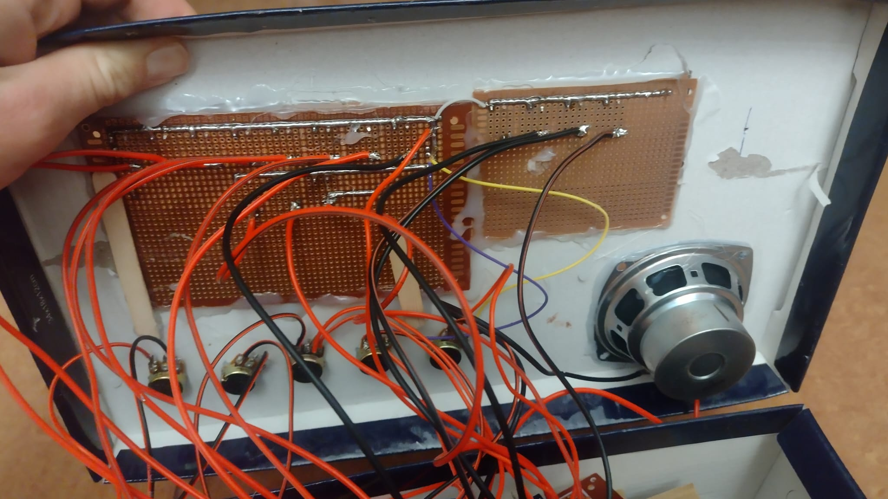
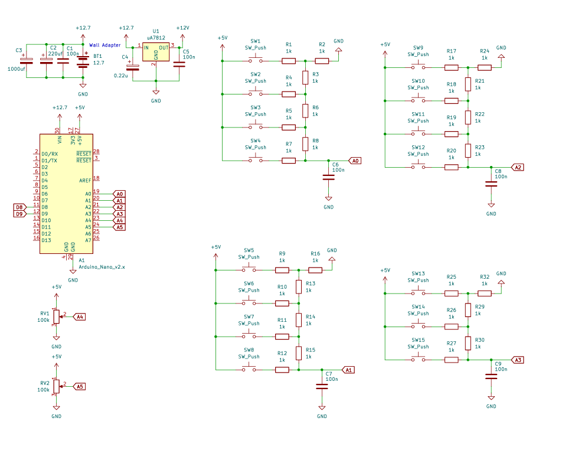

# Sintetizator Audio pe 8-bit (Arduino Nano AVR C)

Acest proiect reprezintă un sintetizator audio cu sequencer integrat, dezvoltat pe un Arduino Nano. Codul este scris în C pur (AVR), fără framework-ul Arduino, folosind timer-ele hardware pentru generarea semnalului PWM și întreruperi pentru citirea butoanelor.

## Structura Repository-ului

* `/src` - Conține codul sursă al proiectului (PlatformIO / C++).
* `/hardware` - Conține schema electrică (PDF/Fișiere sursă).
* `/images` - Fotografii cu montajul fizic și interfața.

## Galerie Foto

Iată cum arată proiectul asamblat fizic:

## Schema Hardware

Puteți găsi documentația completă în folderul `hardware`. Mai jos este o previzualizare a conexiunilor:

